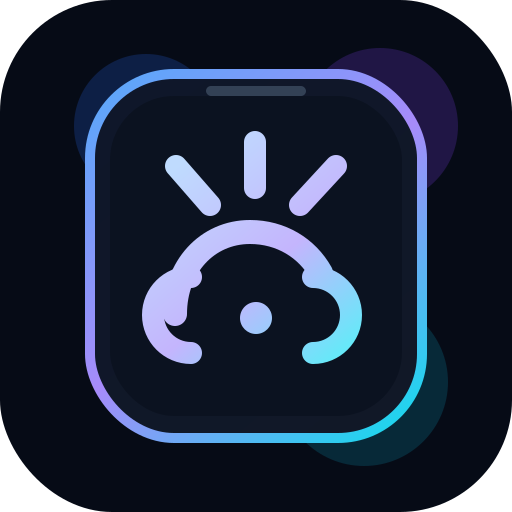
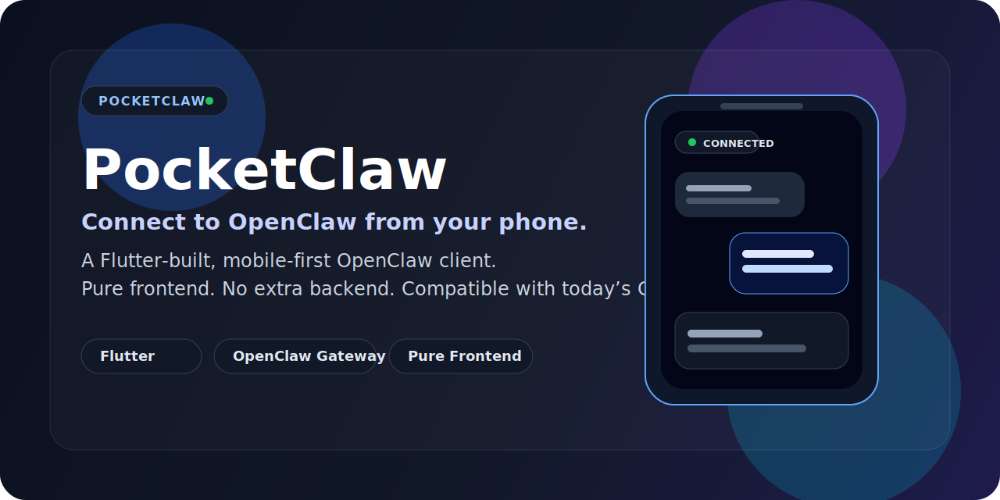
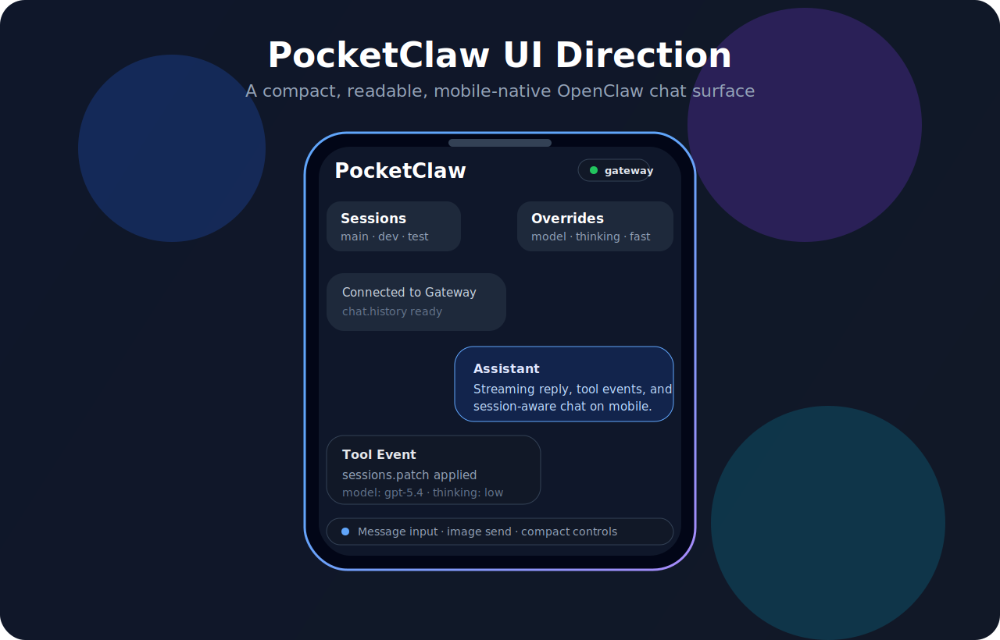

<div align="center">

# PocketClaw



**用手机便捷连接您的 OpenClaw 龙虾 🦞**

*一个使用 Flutter 开发、以手机为优先的 OpenClaw 客户端 —— 纯前端实现，无须额外后端依赖。*

[English](./README.md) · [简体中文](./README.zh-CN.md) · [架构文档](./docs/architecture.md) · [路线图](./docs/roadmap.md)




</div>

## 项目亮点

- **原生移动优先** —— 为真正的手机体验而做，不是浏览器套壳。
- **兼容现有 Gateway** —— 不修改 Gateway，不依赖私有补丁。
- **纯前端实现** —— 不加 custom backend，不增加中间服务层。
- **支持多会话** —— 通过客户端控制 `sessionKey` 创建和切换会话。
- **为未来留空间** —— 核心架构保留向紧凑设备和穿戴端扩展的可能性。

## 预览方向

PocketClaw 正在被打磨成一个 **干净、紧凑、适合手机使用的 OpenClaw 原生客户端**。
当前预期的体验方向是：

- 更快的连接流程
- 更易读的流式聊天体验
- 轻量但清晰的 tool event 展示
- 更顺手的会话切换
- 在小屏上依然自然的紧凑控制设计



> UI 预览素材会随着应用界面逐步稳定而继续迭代。

## 为什么要做 PocketClaw

OpenClaw 已经有能力不错的 Gateway，但现有交互面并不是为原生移动体验优先设计的。
PocketClaw 的目标，是在**不改变服务端语义**的前提下，让 OpenClaw 在手机上用起来更自然。

这个项目想做的事情其实很克制：

- 保持现有部署模型不变
- 提供真正适合手机的原生体验
- 保持架构清晰，而不是做成一次性的 app 壳子

## 当前状态

> **Active prototype / 活跃原型阶段** —— 架构方向和兼容性边界已经明确。

当前主线是完成 **Chat MVP**：

- 连接、鉴权与 pairing
- 聊天历史和消息发送
- 流式回复展示
- Tool call 渲染
- 会话切换与客户端创建新会话
- 图片发送
- 基础 session override（`model`、`thinking`、`fast`、`verbose`）

## 设计原则

- **Gateway-compatible first** —— 以兼容现有 OpenClaw Gateway 行为为第一优先级。
- **No custom backend** —— 不新增中间后端，直接连接 Gateway 现有能力。
- **Mobile-first** —— 先把手机端体验做好，再扩展到更多控制能力。
- **本地凭据加密** —— 连接配置与设备侧认证材料优先放进系统提供的安全存储。
- **客户端控制多会话** —— 在不改变 Gateway 语义的前提下支持多会话。
- **可扩展到穿戴设备** —— 为未来 `WristClaw` 之类的手表客户端保留架构空间。
- **Vibe coded，但有纪律** —— 保持快速迭代，同时严格守住兼容性边界。

## FAQ

### 为什么不直接套 Web UI？

因为 PocketClaw 想做的是一个真正适合手机的客户端。
套壳当然也能工作，但它无法替代为手机场景专门设计的导航、流式展示、会话切换和紧凑交互。

### 为什么不加一个自定义后端？

因为这个项目的核心承诺之一，就是严格围绕今天已有的 OpenClaw Gateway 能力来构建。
额外加后端会增加部署复杂度，也会削弱这个项目最重要的兼容性立场。

### 为什么选 Flutter？

Flutter 很适合做跨平台但仍然精致的移动 UI，同时能保持应用架构清晰、迭代速度快。

### 这是要替代 OpenClaw WebChat 吗？

不是。
PocketClaw 更像一个面向移动端的 companion surface，而不是说所有 OpenClaw 交互都应该搬到手机上。

## 项目地图

| 区域 | 说明 |
| --- | --- |
| [`docs/architecture.md`](./docs/architecture.md) · [中文](./docs/zh-CN/architecture.md) | 客户端分层和模块方向 |
| [`docs/roadmap.md`](./docs/roadmap.md) · [中文](./docs/zh-CN/roadmap.md) | 近期与中期路线 |
| [`docs/mvp-scope.md`](./docs/mvp-scope.md) | 当前 chat MVP 范围 |
| [`docs/compatibility.md`](./docs/compatibility.md) | 与现有 Gateway 的兼容边界 |
| [`docs/session-key-strategy.md`](./docs/session-key-strategy.md) | 基于客户端 sessionKey 的多会话策略 |
| [`docs/gateway-surface-map.md`](./docs/gateway-surface-map.md) | 当前 Gateway 方法与能力映射 |
| [`docs/connect-flow-plan.md`](./docs/connect-flow-plan.md) | 连接与 pairing 交互规划 |
| [`docs/development-workflow.md`](./docs/development-workflow.md) | 开发方式与迭代原则 |
| [`docs/official-android-reference.md`](./docs/official-android-reference.md) | Android 侧交互参考 |

## 架构方向

PocketClaw 会继续把 **协议层**、**状态层**、**UI 层** 拆开，避免客户端逐渐变成和 Gateway payload 强耦合的界面胶水。

建议中的模块结构：

```text
app/
  mobile_ui/
packages/
  gateway_transport/
  gateway_auth/
  gateway_adapter/
  pocketclaw_core/
```

详情见 [`docs/architecture.md`](./docs/architecture.md)。

## PocketClaw 当前不做什么

在当前阶段，PocketClaw **不假设** 以下能力：

- Gateway 侧新功能开发
- 私有存储层 hack
- archive restore API
- 通过 WebView 套壳来实现产品

## Star History

[](https://star-history.com/#PYXXXX/pocketclaw&Date)

## 仓库结构

- `assets/` —— 仓库 banner、UI mockup 与社交分享图素材
- `docs/` —— 产品、架构、兼容性与规划文档
- `app/` —— 移动端应用代码
- `packages/` —— 可复用的协议、状态和适配层模块

## 语言策略

仓库内容以英文为主。
在有帮助的情况下，可同时提供中文版本。
